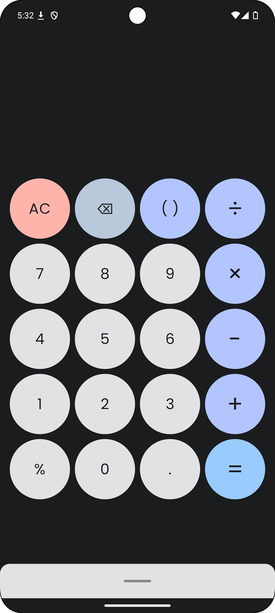
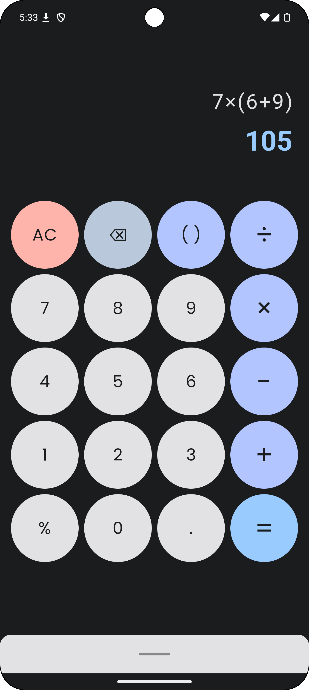
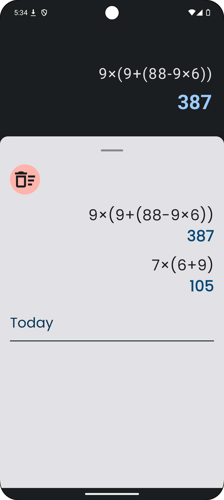

# Arithmetic App with History

## Tech stack
- Kotlin
- Jetpack Compose
- Viewmodel
- Kotlinx Datetime
- [keval](https://github.com/notKamui/Keval)
- Material 3 (Custom Theme : Light and Dark)
- Koin
- Room
- Coroutine - Flow
- Splashscreen
- ConstrainLayout (Motion Layout and Motion Scene)
- Icon Extended

<table>
  <tr>
    <th>Home</th>
    <th>Calculation</th>
    <th>History</th>
  </tr>
  <tr>
    <td></td>
    <td></td>
    <td></td>
  </tr>
</table>
